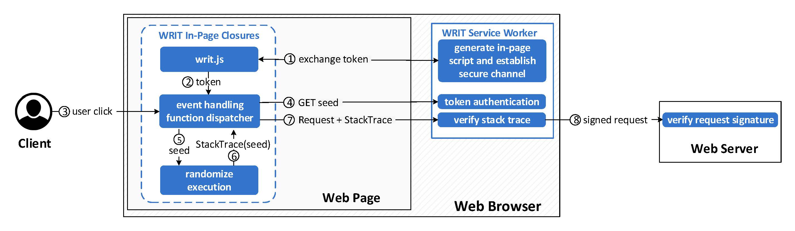

# WRIT

WRIT (Web Request Integrity & Attestation) is a vanilla JavaScript framework that protects critical client-sided code from malicious extension abuse.

## Table of Contents

- [Features](#features)
- [Methodology](#methodology)
- [Browser Support](#browser-support)
- [Installation](#installation)
    - [Server](#server)
    - [Client](#client)
        - [Setup](#setup)
        - [Index](#index)
        - [Service Worker](#service-worker)
- [Reference Implementation](#reference-implementation)
- [Usage](#usage)
- [Credits](#credits)
- [License](#license)

## Features

WRIT enables developers to:
- Run sensitive code in an isolated execution environment WRIT maintains within a custom [Service Worker](https://developer.mozilla.org/en-US/docs/Web/API/Service_Worker_API).
- Validate the authenticity and integrity of sensitive outgoing requests and the code that produced them.

## Methodology

WRIT combines JavaScript closures and Service Workers to create an isolated trusted  component in the user's browser, whose main purpose is to verify if the control flow execution path of selected outgoing requests is benign (or not). A non-benign path could be the result of automation, like an interaction with a UI element by a malicious browser extension – WRIT's primary adversary. As such, WRIT has been carefully designed to operate correctly and securely in their presense.

### Operation Overview



WRIT generates a separate in-page script at each user session, which contains a unique hard-coded identifier. This identifier is used to establish a communication channel, where the exchanged messages can be securely authenticated. Every time the user performs an action, WRIT’s in-page component uses a secret token to request a random seed from the Service Worker. The seed is used to randomize the event handling function's stack trace, which can be verified by the Service Worker using the exact same seed; if the verification succeeds, the Service Worker signs the corresponding request using a pre-established key and forwards it to the back-end web server.

### Execution Randomization


WRIT has the ability to diversify the original execution trace of critical functions,  by creating a series of pseudo-randomly generated redundancy layers in the form of empty JavaScript functions. These new functions form a chain by calling one another in a particular sequence, dictated by a seed that has been used to randomly generate them.

Every time WRIT needs to protect a critical function call `func`, which e.g. sends a request to the server, it creates one such chain and appends `func` to the tail of the chain followed by a stack trace capture. The stack trace will be enriched by the sequence of newly created functions, which uniquely identifies that particular execution of `func`. The random functions add extra levels of differentiation and entropy in the generated stack trace, which becomes exponentially hard for an adversary to spoof or predict.

## Browser Support

WRIT depends on the browser's native implementation of the [Service Worker](https://developer.mozilla.org/en-US/docs/Web/API/Service_Worker_API) and [Promise](https://developer.mozilla.org/en-US/docs/Web/JavaScript/Reference/Global_Objects/Promise) APIs. It has been tested to work successfully on the
latest versions of most major browsers i.e. Chrome, Firefox, Safari, Edge and Opera. Detailed compatibility for each of the two APIs can be examined [here](https://caniuse.com/serviceworkers) and [here](https://caniuse.com/promises).

## Installation

This section serves as a guide on integrating WRIT into an existing client-server setup. For a quick demo of WRIT, please look to the next section for instructions on how to run the [reference implementation](#reference-implementation).

### Server

The first step is to ensure the existing setup WRIT is being integrated into supports HTTPS and plan for future traffic routing strictly over HTTPS.

WRIT is built with the Service Worker API at its core. The API's specification requires that browser implementations of the API only make it available in pages served over HTTPS, due to security concerns. Chrome and Firefox references [here](https://developers.google.com/web/fundamentals/primers/service-workers#you_need_https) and [here](https://developer.mozilla.org/en-US/docs/Web/API/Service_Worker_API#service_worker_concepts_and_usage). Most browsers however allow bypassing this restriction for offline testing purposes: if the server hosts the website or web service locally (localhost or 127.0.0.1), the browser will usually expose the Service Worker API.

Next step is to define and implement WRIT's server routes.

The necessary routes that must be implemented in an existing server for WRIT to function properly are as follows:
- `/setup.js`: Serves WRIT's initial setup script
- `/id`: Based on client-provided user credentials, generates a unique random hexadecimal id
- `/sw.js`: Based on client-provided id, serves the Service Worker script
- `/key`: Based on client-provided id, generates a key for secure server-Service Worker intercommunication
- `/trace`: Based on client-provided signed stack trace, verifies the signature first using the key, then the stack trace and responds according to the verdict

It's worth noting that in all but one of these routes (`/trace`), the server is supposed to respond only once for each registered user, during WRIT's setup phase.

For details feel free to browse through the reference implementation of the server routes in `routes.py`.

### Client

#### Setup

In order to minimize alterations to an existing index/home page, it is recommended to perform WRIT's setup from a secondary page after users have logged into an account. The setup page should warn (or force) users to temporarily disable all extensions before proceeding with the setup process.

During the setup process, the setup page is responsible for obtaining WRIT's secrets from the server and setting up WRIT's Service Worker. In short, it's a three step process composed of:
- requesting a unique id for the user at `/id`
- then using the id to request ([ServiceWorkerContainer.register](https://developer.mozilla.org/en-US/docs/Web/API/ServiceWorkerContainer/register)) a new Service Worker for this user
- and finally requesting a unique key for the user at `/key` which is afterwards stored in the Service Worker

For details feel free to browse through the reference implementation of the setup page and JS code in `setup.html` and `setup.js` respectively.

#### Index

After setting WRIT up, the main/index page (and any subpages) should run WRIT's closure at the earliest possible point of execution e.g. top of the `<head>`. The closure has two objectives: first, to obtain WRIT's library from the Service Worker and not the remote server to ensure it's untampered and second, to keep the library's code isolated from the rest of the page's code and only accessible through specific public function(s).

In practice, WRIT's in-page closure must:
- make sure WRIT's Service Worker is up and running
- request WRIT's library from the Service Worker at `/lib.js` and then evaluate the library's code out of its string form
- finally expose the evaluation's result to the page's execution context i.e. `window`

For details feel free to browse through the reference implementation of the closure in `index.html` and the library in `sw.js`.

#### Service Worker

WRIT's Service Worker script is conceptually composed of three segments:
- libraries
- helper functions and global variables
- event listeners

In the first segment lie any external libraries the rest of the code may require. Since the client cannot be trusted, the Service Worker has no guarantees in regard to the integrity of external code fetched during runtime/after setup. In the reference implementation for example, the [seedrandom](https://github.com/davidbau/seedrandom) library is included (in minified form) within the script for the Service Worker's random number generation needs.

The second segment contains WRIT's library in string form (to be run in visited pages) and a collection of short helper functions and variables used in the event listeners of the last segment.

The third and final segment is comprised of the Service Worker's listeners for three separate events: `install`, `activate` and `fetch`. The first two respond to the installation and activation of the Service Worker respectively, while the third runs when a page controlled by the Service Worker produces a new request – more info on Service Worker architecture [here](https://developer.mozilla.org/en-US/docs/Web/API/Service_Worker_API/Using_Service_Workers#basic_architecture).

By default the `fetch` listener allows Service Workers to function as network proxies, traditionally responding to the client using cached data. In WRIT, the `fetch` listener treats incoming requests as commands to execute specific tasks based on each request's path.

In practice, the Service Worker checks the requested URL for a match with a few predefined "internal communication" URLs it expects from WRIT's in-page (and in-closure) code execution. Namely, these are:
- `/lib.js`: WRIT closure code asking for WRIT's library code
- `/key`: setup code instructing the Service Worker to obtain and store the server-Service Worker intercommunication key
- `/rng_seed`: WRIT library asking for a seed to randomize a stack trace
- `/trace`: WRIT library sending a stack trace for validation
<?- `/get_otp`: (optional) page asking for an OTP code, part of the 2FA demo
- `/check_otp`: (optional) page asking the Service Worker to validate an OTP code?>

If the URL is none of the above, the request is forwarded directly to the network without any alterations.

Please note that each unique scope is allowed exactly one Service Worker registration, so registering a dedicated Service Worker for WRIT will replace the existing Service Worker in that scope – Google reference [here](https://developers.google.com/web/ilt/pwa/introduction-to-service-worker#registration_and_scope).

For details feel free to browse through the reference implementation's Service Worker script in `sw.js`.

## Reference Implementation

Manual Installation (requires Python):

1a. Install Flask and run WRIT's Flask server
```console
python -m pip install flask
python server/run.py
```

Docker Container (requires Docker):

1b. Build the image using the provided Dockerfile and start the container:
```console
docker build -t writ .
docker run -dp 5000:5000 writ
```

Once the Flask server is running:

2. Open a browser and navigate to `localhost:5000`
3. Use the topmost UI button to log in and install WRIT's Service Worker.
4. Use any of the UI buttons or programmatically access the exposed global object `window.WRIT`.

## Usage

The main method exposed by WRIT is `post`, which requires a function that produces a request. Optionally, it accepts that function's arguments, the event triggering the function call and the number of dummy functions to be added in the randomized execution chain.
```js
async function post(callback, args, e, funcs)
```

Example using post:
```html
<body>
    <script>
        function create_request() {
            let config = {method: "POST", body: "text"};
            return {path: "/path", config};
        }
    </script>
    <button onclick='WRIT.post(create_request, e=event);'></button>
</body>
```

## Credits

WRIT's reference implementation uses [seedrandom](https://github.com/davidbau/seedrandom) for its random number generation needs and [JS-OTP](https://github.com/jiangts/JS-OTP) in its 2FA demo for creating and verifying one time passwords.

## License

[MIT](source/server/writ/LICENSE.md)
